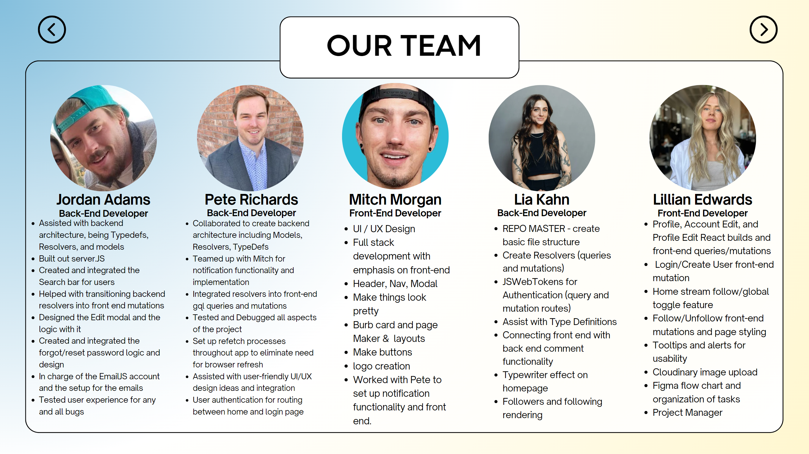

# Blurb

## Description

Blurb is a dynamic and interactive microblogging platform that empowers users to share their thoughts, ideas, and stories in bite-sized messages called 'Blurbs.' With a character limit tailored for brevity, Blurb enables users to express themselves concisely, engaging in real-time conversations with a global community of diverse individuals.

Share your insights, interests, and updates. Stay up-to-date with trending topics, follow your favorite influencers, and engage in lively discussions. Whether you're into politics, technology, entertainment, or everyday life, Blurb provides a platform to connect, learn, and voice your opinions.

Customize your profile, curate your feed, and interact with other users by liking, Blurbing, and commenting on their Blurbs. Explore relevant tags, create your own trends, and watch your following grow. Blurb offers a seamless, user-friendly experience, ensuring that your ideas are heard, one Blurb at a time.

Stay connected with the world, stay informed, and become part of a vibrant online community. Join Blurb and start sharing your world in 255 characters or less!

Click [here](https://blurb4-web-6d7dbae39646.herokuapp.com/) to start using Blurb!

## Table of Contents

- [Installation](#installation)
- [Usage](#usage)
- [Credits](#credits)
- [License](#license)

## Installation

What are the steps required to install your project? Provide a step-by-step description of how to get the development environment running.

## Usage

To use our app, open our web app and you'll be directed to the initial webpage! Here are screen shots showing how Blurb functions and looks.

## Credits

[Lillian Edwards](https://github.com/lillianedwards)
[Jordan Adams](https://github.com/JMADA257)
[Mitchell Morgan](https://github.com/M1TCH3llM)
[Pete Richards](https://github.com/PRich57)
[Lia Kahn](https://github.com/ljkahn)

## License

[MIT](https://opensource.org/license/mit/)

## Features

##### Login/Create Account
 Upon loading the web application, you will see a polished homepage with a randomly generated Blurb, and a user friendly interface. From the home page you will be prompted to create an account, or login.

##### User Authentication
To create an account, click "Create" on the middle sign.

Enter your full name, email address, desired password, and username into the modal. You can also choose to add a profile picture as well.
Click the "Create Account" button to complete the account creation process and be automatically logged into your account.

##### Search Bar
Search for other users on Blurb by using the search bar at the top of the screen.

##### Home Page
When signed in, along the bottom of the page will be the home button, "fire"/trending Blurbs button, a create a Blurb button in the center, a notifications page (under construction), and your profile button.

##### "Fire"/Trending Blurbs
When you click on the fire button, Blurbs with ten or more likes will appear. You can comment and like the Blurbs and their respective comments.

##### Create a Blurb
To create a Blurb, click on the center button on the bottom of the screen with the word bubble on it. You will be prompted to create a Blurb and you can tag it from a list of popular trending topics.

##### Notifications
This page is under construction and will be up soon!

##### Your Profile
Click on the profile icon to see your profile and see your Blurbs and the comments on them.

##### Edit Profile
You can click the edit profile button and be able to change your profile picture, name, username, location, and add a bio. You can also click on profile settings and be able to update your email and password or delete your account.

##### Logout
Once you're done hit the log out button on the top right corner.

## Contributing

If you would like to contribute please contact the creators on linked in.

[Lillian Edwards](https://www.linkedin.com/in/lillian-edwards63/)

[Mitch Morgan](https://www.linkedin.com/in/mitchell-morgan-0952b1138/)

[Lia Kahn](https://www.linkedin.com/in/lia-kahn/)

[Pete Richards](https://www.linkedin.com/in/peterrichards57)

[Jordan Adams](https://www.linkedin.com/in/jordan-adams-a14602288/)

## Organization/Process

Here we've linked our slides, our Figma brainstorm, and our Figma mobile wireframe.

[Slides](https://www.canva.com/design/DAFzEXjIc1I/-ct3nu6yj8wsMWfL3v8LXA/view)

[Figma Brainstorm](https://www.figma.com/file/veDYK1ciMVqf9YKiKsBoIs/Project-3-Brainstorm?type=whiteboard&t=1m8m0yWbdUm6kpTv-0)

[Figma Mobile Wireframe](https://www.figma.com/file/wGAL8buhdWjddEeLUsIDVR/BlurbMobileWire?type=design&node-id=0-1&mode=design&t=57Hyi1eE0JFzB7rb-0)
